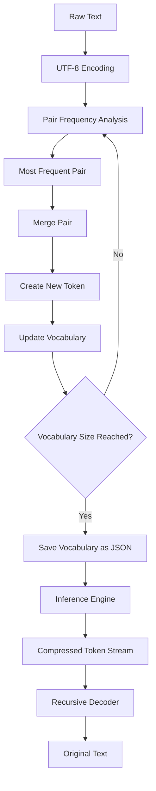
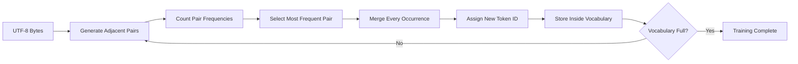
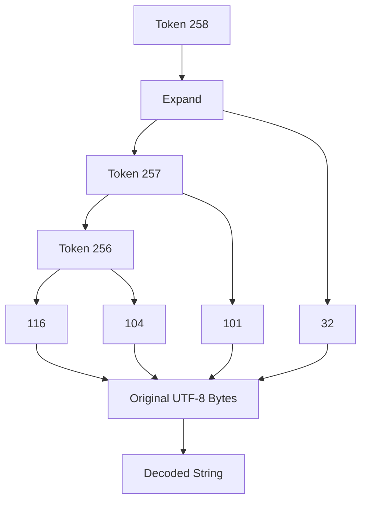

```text
██╗   ██╗██╗  ██╗███╗   ███╗
╚██╗ ██╔╝██║ ██╔╝████╗ ████║
 ╚████╔╝ █████╔╝ ██╔████╔██║
  ╚██╔╝  ██╔═██╗ ██║╚██╔╝██║
   ██║   ██║  ██╗██║ ╚═╝ ██║
   ╚═╝   ╚═╝  ╚═╝╚═╝     ╚═╝

████████╗██╗██╗  ██╗██╗████████╗ ██████╗ ██╗  ██╗ ██████╗
╚══██╔══╝██║██║ ██╔╝██║╚══██╔══╝██╔═══██╗██║ ██╔╝██╔═══██╗
   ██║   ██║█████╔╝ ██║   ██║   ██║   ██║█████╔╝ ██║   ██║
   ██║   ██║██╔═██╗ ██║   ██║   ██║   ██║██╔═██╗ ██║   ██║
   ██║   ██║██║  ██╗██║   ██║   ╚██████╔╝██║  ██╗╚██████╔╝
   ╚═╝   ╚═╝╚═╝  ╚═╝╚═╝   ╚═╝    ╚═════╝ ╚═╝  ╚═╝ ╚═════╝
```

# 🧩 YKM TikiToko — Byte Pair Encoding Tokenizer (Built From Scratch)

[](https://www.python.org/)
[]()
[]()
[]()
[]()

> **Understanding modern tokenizers by rebuilding one from first principles.**
>
> **YKM TikiToko** is a complete educational implementation of the **Byte Pair Encoding (BPE)** algorithm. The project reconstructs the full tokenizer lifecycle—including **training**, **vocabulary construction**, **JSON serialization**, **inference**, and **recursive decoding**—without relying on external tokenization libraries such as **tiktoken**, **SentencePiece**, or **HuggingFace Tokenizers**.

---

# 📖 Why This Project?

Every Large Language Model—whether it's **GPT**, **Llama**, **Gemini**, **Claude**, or **DeepSeek**—must first convert raw text into numerical tokens before any neural computation begins.

Although libraries such as **tiktoken** make this process incredibly efficient, they abstract away the underlying algorithm.

Rather than treating tokenization as a black box, I wanted to understand what actually happens under the hood.

Some of the questions that motivated this project were:

- ❓ How are new tokens created?
- ❓ Why are merge operations performed greedily?
- ❓ How is the learned vocabulary represented internally?
- ❓ Why does inference not require retraining?
- ❓ Why does decoding naturally become a recursive problem?

Instead of simply reading about the algorithm, I decided to implement it entirely from scratch.

This project therefore prioritizes **understanding** over **optimization**.

The goal is not to compete with production-grade tokenizers—but to understand every individual step involved in transforming raw UTF-8 text into reusable learned tokens.

---

# 🎯 Project Objectives

This implementation focuses on five primary goals:

- 🧠 Understand Byte Pair Encoding from first principles.
- 🏗️ Build every stage manually instead of relying on libraries.
- 🧩 Design clean, modular, and reusable components.
- 🔄 Separate the concepts of **training** and **inference**.
- 📚 Produce an implementation that is easy to study and extend.

Every significant component of the tokenizer has been written manually.

---

# 🗂 Repository Structure

```text
📦 YKM-TikiToko
│
├── 📄 YKMtikitoko.py
│      Core tokenizer implementation
│
│      • UTF-8 Encoding
│      • Pair Frequency Analysis
│      • Merge Operations
│      • Vocabulary Construction
│      • Recursive Decoder
│      • JSON Serialization
│      • Inference Engine
│
├── 📄 Handler.py
│      Demonstration script
│
│      • Training Pipeline
│      • Compression Statistics
│      • Vocabulary Inspection
│      • Inference Demo
│      • Decoding Verification
│
└── 📄 pretrained_vocab_token_merges.json
       Serialized vocabulary generated after
       training and reused during inference.
```

---

# 🧠 Design Philosophy

Instead of approaching the problem as:

> **"Build a tokenizer."**

I approached it as:

> **"What collection of smaller, independent problems together become a tokenizer?"**

That single change in perspective shaped the entire architecture of this project.

By decomposing the algorithm into independent modules, each stage could be implemented, tested, and debugged individually before being integrated into the complete tokenizer.

This modular approach also makes the project significantly easier to understand, maintain, and extend.

---

# 💭 Original Thought Process

Before writing any code, I sketched rough implementation notes to decompose the algorithm into manageable pieces.

I've intentionally preserved those notes below because they represent the design process that eventually evolved into the finished implementation.

### Initial High-Level Plan

```text
1. UTF-8 Encoding

2. Pair Frequency Analysis

3. Merge Operation

4. Recursive Decoding

5. Training Loop
```

### Early Function Breakdown

```text
Functions I can make:

1) UTF-8 Encoding
   • Convert every character into UTF-8 byte tokens.

2) Pair Frequency Analysis
   • Generate adjacent token pairs.
   • Count the occurrence of every pair.
   • Return the most frequent pair.

3) Merge Function
   • Replace every occurrence of the selected pair.
   • Assign a newly generated token ID.

4) Recursive Decoder
   • Expand merged tokens back into their
     original UTF-8 byte representation.

5) Training Loop
   • Repeat until the desired vocabulary
     size has been reached.
```

Looking back, these notes already described nearly the complete architecture of the finished tokenizer.

The implementation simply transformed these ideas into code.

---

# ✨ Current Features

✔ UTF-8 Byte Encoding

✔ Pair Frequency Analysis

✔ Greedy Byte Pair Encoding (BPE)

✔ Vocabulary Construction

✔ Recursive Token Expansion

✔ Vocabulary Serialization (JSON)

✔ Vocabulary Loading

✔ Inference on Previously Unseen Text

✔ Compression Statistics

✔ Fully Documented Source Code

---

> **Next:** We'll explore how the tokenizer actually works internally—from UTF-8 encoding all the way to recursive decoding—using architecture diagrams and visual walkthroughs.

# ⚙️ Tokenizer Architecture

The tokenizer is divided into **three independent stages**:

1. **Training** — Learn merge rules from a corpus.
2. **Inference** — Encode completely new text using the learned vocabulary.
3. **Decoding** — Reconstruct the original UTF-8 text through recursive expansion.

Keeping these stages independent makes the implementation significantly easier to understand, test, and extend.

---

# 🏗️ Complete Tokenizer Pipeline



---

# 🧠 Training Pipeline

Training is the only stage that **learns**.

Its purpose is to repeatedly discover frequently occurring byte pairs and replace them with newly generated tokens.

Each iteration performs exactly the following steps:



The tokenizer continues merging until the requested vocabulary size has been reached.

Unlike production tokenizers, this implementation deliberately favors readability over raw performance.

---

# 📊 Example Training Iteration

Suppose the training corpus contains

```text
the the there
```

After UTF-8 encoding, the token stream becomes

```text
[116,104,101,32,116,104,101,32,116,104,101,114,101]
```

The tokenizer then generates adjacent pairs.

| Pair | Frequency |
|------|----------:|
| (116,104) | 3 |
| (104,101) | 3 |
| (101,32) | 2 |
| (32,116) | 2 |
| ... | ... |

Suppose `(116,104)` is selected.

A new token is generated.

```text
256 → (116,104)
```

Every occurrence of

```text
(116,104)
```

is replaced by

```text
256
```

The process then repeats using the updated token stream.

This greedy strategy gradually compresses the corpus while simultaneously constructing the tokenizer's vocabulary.

---

# 📚 Vocabulary Construction

Every successful merge creates **one new token**.

For example,

```text
256 → (116,104)
257 → (256,101)
258 → (32,116)
```

Notice something important.

Token **257** does **not** point directly to bytes.

Instead,

```text
257

↓

(256,101)
```

and token **256** expands to

```text
(116,104)
```

The learned vocabulary therefore naturally forms a tree.

```text
257
│
├──256
│   ├──116
│   └──104
│
└──101
```

This observation eventually becomes the reason recursive decoding is required.

---

# 💾 Vocabulary Serialization

Once training finishes, the learned merge rules are automatically written to disk.

```text
pretrained_vocab_token_merges.json
```

Example structure:

```json
{
    "256": [116, 104],
    "257": [256, 101],
    "258": [32, 116]
}
```

Persisting the vocabulary means the tokenizer only needs to be trained **once**.

Every future encoding operation can reuse the same learned merges.

---

# 📄 Vocabulary File Format

After the training phase completes, the tokenizer automatically serializes every learned merge rule into a JSON file.

This vocabulary is later reloaded during inference, allowing previously unseen text to be encoded **without retraining**.

Example:

```json
{
    "256": [116, 104],
    "257": [256, 101],
    "258": [32, 116],
    "259": [257, 258]
}
```

Each entry follows the structure

```text
"Token ID" : [Left Token, Right Token]
```

where

- **Key** → Newly generated token ID.
- **Value** → The pair of tokens that produced that new token.

Notice that values may reference **previously learned token IDs** rather than only UTF-8 byte values.

For example,

```json
"257": [256, 101]
```

means that token **257** expands to

```text
(256, 101)
```

and token **256** must itself be recursively expanded until only original UTF-8 bytes remain.

This nested representation is precisely why the decoder performs recursive traversal instead of a simple dictionary lookup.

> **Note:** The vocabulary is learned only once during training. During inference, this JSON file is loaded and replayed exactly as it was generated, ensuring deterministic tokenization without modifying the learned merge rules.

# 🚀 Inference Pipeline

Unlike training, inference performs **no learning whatsoever**.

Instead, it simply reloads the previously learned vocabulary and replays every merge operation in the exact order they were originally discovered.


Notice that **no pair frequency analysis occurs during inference**.

The tokenizer already knows which merges should be applied because they were learned during training.

This separation between **training** and **inference** closely mirrors the workflow used by production tokenizers.

---

# 🔁 Why Merge Order Matters

During training, merges occur sequentially.

For example,

```text
256 → (116,104)

257 → (256,101)

258 → (257,32)
```

Notice that token **257** depends on token **256**, and token **258** depends on **257**.

Because of these dependencies, merge rules **must be replayed in the exact order they were originally created**.

This is why the implementation iterates through vocabulary IDs in ascending order during inference.

```
256

↓

257

↓

258
```

Changing this order would produce incorrect token streams.

---

# 🌳 Recursive Decoding

Decoding performs the exact opposite operation.

Instead of compressing tokens, it recursively expands every merged token until only original UTF-8 byte values remain.



A simple lookup is therefore insufficient.

Merged tokens may themselves contain previously merged tokens, requiring recursive expansion until only base UTF-8 bytes remain.

---

# 🎯 Design Decisions

Throughout development, several deliberate engineering decisions were made.

| Decision | Reason |
|-----------|--------|
| UTF-8 byte representation | Mirrors modern tokenizer implementations. |
| Separate Training & Inference | Prevents accidental vocabulary modification during encoding. |
| JSON vocabulary storage | Allows reusable pretrained tokenizers. |
| Recursive decoding | Naturally handles nested merge structures. |
| Modular functions | Easier debugging, testing and future extension. |

---

> **Next:** We'll explore the internal code architecture, every major function, API usage examples, handler output, and compression statistics generated by the tokenizer.

# 📚 Code Architecture

The tokenizer is intentionally designed around **small, single-purpose functions**.

Rather than placing the entire algorithm inside one large method, every stage of the Byte Pair Encoding pipeline has its own dedicated responsibility.

This results in code that is significantly easier to understand, debug, test, and extend.

---

# 🛠 Public API

The `Tikitoko` class exposes a minimal public interface while encapsulating the internal implementation details.

| Function | Description |
|-----------|-------------|
| `initialize_tokenizer()` | Initializes tokenizer configuration and prepares internal data structures. |
| `training()` | Learns merge rules from a training corpus and serializes the vocabulary. |
| `inference_handling()` | Encodes previously unseen text using a saved vocabulary. |
| `decoding_to_str()` | Recursively reconstructs the original UTF-8 string from compressed tokens. |

These four methods represent the complete lifecycle of the tokenizer.

---

# 🔧 Internal Helper Functions

Several helper functions perform the individual algorithmic steps that together form the complete BPE pipeline.

| Function | Responsibility |
|-----------|----------------|
| `utf_encoding()` | Converts raw text into UTF-8 byte tokens. |
| `get_hook()` | Generates adjacent token pairs, counts frequencies, and returns the most frequent pair. |
| `merging()` | Replaces every occurrence of the selected pair with a newly generated token ID. |

Although these functions are relatively small, together they implement the complete Byte Pair Encoding algorithm.

---

# 📦 Typical Workflow

The intended workflow is deliberately straightforward.

```python
from YKMtikitoko import Tikitoko

tokenizer = Tikitoko()

tokenizer.initialize_tokenizer(
    required_vocab_size=100
)

tokenizer.training(training_text)

encoded = tokenizer.inference_handling(
    raw_text="Hello World!"
)

decoded = tokenizer.decoding_to_str(encoded)
```

Internally, this performs:

```text
Training
↓

Vocabulary Construction

↓

JSON Serialization

↓

Inference

↓

Recursive Decoding
```

---

# 🚀 Example Output

Running the supplied handler demonstrates the complete tokenizer lifecycle.

```text
============================================================
TRAINING
============================================================

Original Token Stream
[...]

Length : 126

Compressed Token Stream
[...]

Length : 91

Compression Ratio : 0.72

Decoded Text

Byte Pair Encoding (BPE)...

Learned Vocabulary

256 -> (66, 121)

257 -> (256, 116)

...
```

Inference then demonstrates vocabulary reuse.

```text
============================================================
INFERENCE
============================================================

Input Text

The tokenizer should now encode...

Original Tokens

[...]

Compressed Tokens

[...]

Compression Ratio : 0.79

Decoded Text

The tokenizer should now encode...
```

Notice that **no new merge rules are generated** during inference.

The tokenizer simply reuses the vocabulary produced during training.

---

# 🗄 Internal Data Structures

The tokenizer relies on only a handful of simple data structures.

### Token Stream

```python
[
116,
104,
101,
32,
116,
104,
101
]
```

Represents UTF-8 bytes or compressed token IDs.

---

### Vocabulary

```python
{
256: (116,104),
257: (256,101),
258: (32,116)
}
```

Maps newly generated token IDs to the pair they replace.

---

### Pair Frequency Table

```python
{
(116,104): 8,

(104,101): 8,

(101,32): 5
}
```

Constructed during each training iteration.

The most frequent pair becomes the next merge candidate.

---

# 📊 Compression Statistics

The handler automatically reports compression efficiency after both training and inference.

Compression ratio is calculated as

```text
compressed_tokens
──────────────────
 original_tokens
```

Example

```text
Original Tokens      : 126

Compressed Tokens    : 91

Compression Ratio    : 0.72
```

A lower ratio indicates that more repeated patterns have successfully been replaced by learned tokens.

---

# ⚡ Computational Complexity

Since this implementation prioritizes readability over optimization, pair frequencies are recomputed during every merge iteration.

| Operation | Complexity |
|-----------|-----------:|
| UTF-8 Encoding | O(n) |
| Pair Generation | O(n) |
| Pair Counting | O(n) |
| Merge Operation | O(n) |
| Recursive Decoding | O(k) |
| Complete Training | Approximately O(n × m) |

Where

- **n** = length of the token stream
- **m** = number of merge iterations

Production implementations employ significantly more sophisticated techniques to reduce this complexity.

This project intentionally favors algorithmic clarity instead.

---

# 🎓 What This Project Demonstrates

Although compact, this implementation explores a surprisingly broad collection of computer science concepts.

### Algorithms

- Greedy Algorithms
- Frequency Analysis
- Compression Techniques
- Recursive Tree Traversal

### Data Structures

- Dictionaries
- Lists
- Trees
- Hash Maps

### Software Engineering

- Modular Design
- Separation of Concerns
- Serialization
- API Design
- Documentation

### Natural Language Processing

- UTF-8 Encoding
- Byte Pair Encoding
- Vocabulary Construction
- Tokenization Pipelines

---

# 💡 One Interesting Observation

One realization that significantly influenced the implementation was that **every merge operation naturally constructs a tree**.

For example,

```text
258

↓

(257,32)

↓

257

↓

(256,101)

↓

256

↓

(116,104)
```

This explains why recursive decoding is not simply an implementation choice—it is a direct consequence of how the vocabulary is constructed.

Understanding this relationship was one of the most rewarding insights gained while building the project.

---

> **Next:** The final section covers future improvements, lessons learned, references, acknowledgements, and closing remarks.

# 🚀 Future Improvements

Although the tokenizer successfully implements the complete Byte Pair Encoding pipeline, there are still several interesting directions for future development.

These improvements primarily focus on **performance**, **usability**, and **scalability**, rather than core functionality.

---

## ⚡ Performance Optimizations

This implementation intentionally prioritizes algorithmic clarity over execution speed.

Several optimizations could significantly improve performance for larger training corpora.

Potential improvements include:

- Incremental pair-frequency updates instead of recomputing frequencies after every merge.
- More efficient merge operations with reduced memory allocations.
- Optimized data structures for faster vocabulary lookups.
- Parallel preprocessing for large datasets.

The current implementation recomputes pair frequencies after every iteration because it keeps the algorithm easy to understand and debug.

---

## 📂 Configurable Vocabulary Files

Currently, the tokenizer saves and loads the vocabulary using a fixed JSON filename.

A future version could allow users to specify custom save and load locations.

```python
tokenizer.training(
    text_by_user=text,
    save_path="english_vocab.json"
)

tokenizer.inference_handling(
    raw_text=text,
    vocab_path="english_vocab.json"
)
```

This would make it possible to maintain multiple pretrained vocabularies for different languages or datasets.

---

## 📚 Training on Larger Corpora

The current handler demonstrates the tokenizer using relatively small training samples.

Training on significantly larger datasets would naturally produce richer merge rules and improved compression.

Possible datasets include:

- Wikipedia Dumps
- Project Gutenberg
- OpenWebText
- Common Crawl
- The Pile

---

## 📊 Benchmarking

It would be interesting to compare this implementation with production tokenizers using metrics such as:

- Training time
- Encoding speed
- Decoding speed
- Compression ratio
- Memory consumption

This would provide useful insight into the trade-off between algorithmic clarity and production-level optimization.

---

# 📚 References

This project was inspired by publicly available research on Byte Pair Encoding and modern tokenizer implementations.

- **Sennrich, Haddow & Birch (2016)** — *Neural Machine Translation of Rare Words with Subword Units*
- **OpenAI** — *tiktoken*
- **Google Research** — *SentencePiece*
- **HuggingFace** — *Tokenizers*

Although these resources inspired the underlying concepts, every line of code in this repository was implemented independently as part of the learning process.

---

# 🎓 What I Learned

Building this project provided considerably more insight than simply implementing a compression algorithm.

It became an opportunity to explore several important Computer Science concepts through one practical project.

### 🧠 Natural Language Processing

- Byte Pair Encoding
- UTF-8 tokenization
- Vocabulary construction
- Token compression
- Training vs. inference workflows

### ⚙️ Algorithms

- Greedy optimization
- Frequency analysis
- Recursive traversal
- Compression techniques

### 💻 Software Engineering

- Modular architecture
- Separation of concerns
- API design
- JSON serialization
- Documentation
- Project organization

Perhaps the most valuable lesson was realizing that understanding a complex system begins by decomposing it into a collection of smaller, independently solvable problems.

---

# 📈 Project Summary

The current implementation supports the complete educational Byte Pair Encoding workflow.

| Component | Status |
|-----------|:------:|
| UTF-8 Encoding | ✅ |
| Pair Frequency Analysis | ✅ |
| Greedy BPE Training | ✅ |
| Merge Operations | ✅ |
| Vocabulary Construction | ✅ |
| Recursive Decoding | ✅ |
| Vocabulary Serialization | ✅ |
| Vocabulary Loading | ✅ |
| Inference on Unseen Text | ✅ |
| Compression Statistics | ✅ |
| Modular Architecture | ✅ |
| Comprehensive Documentation | ✅ |

---

# 🤝 Contributing

Suggestions, bug reports, and improvements are always welcome.

If you discover an issue or have an idea for improving the implementation, feel free to open an issue or submit a pull request.

Constructive feedback is always appreciated.

---

# 👨‍💻 Author

**Yatharth Keshavamurthy** 
**(YKM)**

Computer Science student passionate about understanding Machine Learning systems by implementing them from first principles.

Projects in the **YKM** series focus on rebuilding core AI and Machine Learning concepts without relying on high-level abstractions.

Current repositories include:

- 🧩 YKM TikiToko — Byte Pair Encoding Tokenizer  
- 🧠 YKM NeuralNet — Artificial Neural Network  [Go to YKM NueralNet](https://github.com/Yadaart-real/YKM-NeuralNet.git)

More educational implementations are planned as the series grows.

---

### GitHub

```text
https://github.com/Yadaart-real
```

---

# ⭐ Closing Thoughts

Modern machine learning libraries often reduce complex algorithms to a single function call.

This project was an opportunity to look beneath that abstraction.

Rather than treating tokenization as a black box, I rebuilt the complete Byte Pair Encoding pipeline—from raw UTF-8 bytes to recursive decoding—to better understand the ideas powering modern language models.

Although this implementation is educational in nature, the overall workflow closely mirrors that of production tokenizers:

```text
           Train Once
               │
               ▼
     Learn Merge Rules
               │
               ▼
     Build Vocabulary
               │
               ▼
     Serialize to JSON
               │
               ▼
 Encode Previously Unseen Text
               │
               ▼
 Recursive Token Decoding
```

The code intentionally favors clarity over optimization so that every stage of the algorithm can be studied independently.

If this repository helps someone better understand how modern tokenizers work internally, then it has achieved exactly what it was built for.

---

<div align="center">

### ⭐ If you found this project interesting, consider giving it a star!

**Thank you for taking the time to explore YKM TikiToko.**

</div>

